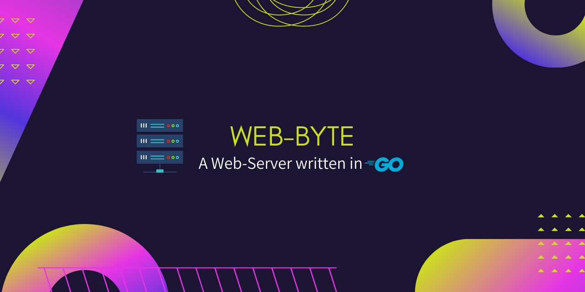

# byte-server
A Web-Server utility written in Golang.

# Contents

- [Installation](#installation)
- [Usage](#usage)
- [License Information](#license)


# Installation :floppy_disk:

The project can either be used as a package and be imported into programs like so:

```go
// For the source:
import "github.com/NovusEdge/web-byte/src"

// For the server handlers:
import "github.com/NovusEdge/web-byte/src"
```

Alternatively, this repository can be cloned for server code generation or directly running `webbyte.go` to create the web server.

```console
user@machine$ git clone https://github.com/NovusEdge/web-byte.git
user@machine$ cd web-byte
user@machine$ bash setup/setup.bash

# Run the program directly
user@machine$ go run webbyte.go

# Or build it and run it directly
user@machine$ go builf webbyte.go && ./webbyte
```

**NOTE**: _The CLI for code generation is currently under development._


# Usage :book:

The complete usage information, along with documentation can be found in the [project wiki](https://github.com/NovusEdge/web-byte/wiki)


# License :scroll:

This project is licensed under the `Mozilla Public License v2.0`. For more details check the [LICENSE file](LICENSE)
